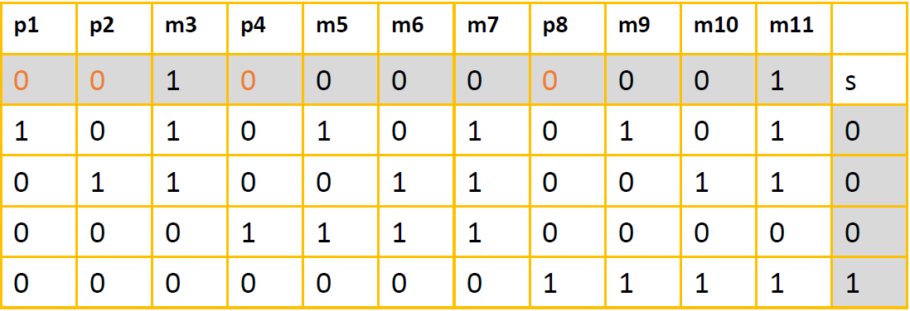
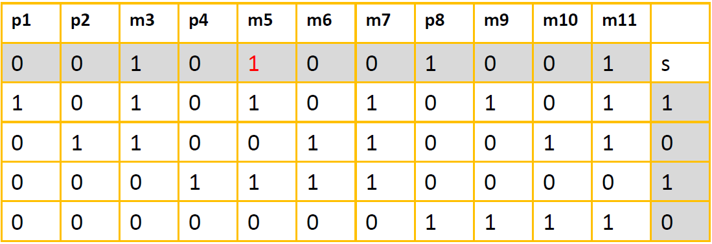

# Hamming-Code-Implementation

This project is a task on course "Fundamentals of telecommunication technologies" by A.A. Kureev (is also a Project on Computer Technologies course [_4th semester_] at MIPT). The task was to implement encode/decode utilties for single-bit error correcting.

## Table of Contents
1. [Requirements](#requirements)
2. [Building](#building)
3. [Usage](#usage)
    * [Examples](#c-examples)
4. [How it works](#how-it-works)
    * [Encoding](#encoding-message)
    * [Decoding](#decoding-message)
5. [TODO List](todo-list)
6. [References](#references)

## Requirements

The following application has to be installed:
- CMake of version 3.15 (or higher)

## Building

***Step 1:*** Clone this repository.
```bash
git clone git@github.com:d-r-tikhonov/Hamming-Code-Implementation.git
cd Hamming-Code-Implementation
```

***Step 2:*** Create `build` folder.
```bash
mkdir build
cd build
```

***Step 3:*** Use CMake:
```bash
cmake ..
cmake --build . --config <Debug|Release>
``` 

***Step 4:*** Build the project and run the program:
```bash
make
./bin/HammingCode
```

## Usage

### Examples

Single-bit Error Correction
```c++
    ...
    #include "hamming_code.hpp"
    ...
    uint32_t n_bits = 16;
    uint32_t input_message = 0x4235;

    std::string encoded_message = hamming_code::encode(input_message, n_bits);
    std::cout << "Encoded message: 0x" << std::hex << std::stoul(encoded_message, 0, 2) << std::endl;

    std::string decoded_message = hamming_code::decode(std::stoul(encoded_message, 0, 2), encoded_message.length());
    std::cout << "Decoded message: 0x" << std::hex << std::stoul(decoded_message, 0, 2) << std::endl;

    std::string encoded_noise_message = replaceRandomChar(encoded_message);
    std::cout << "Noise encoded message: 0x" << std::hex << std::stoul(encoded_noise_message, 0, 2) << std::endl;

    std::string decoded_noise_message = hamming_code::decode(std::stoul(encoded_noise_message, 0, 2), encoded_noise_message.length());
    std::cout << "Decoded noise message: 0x" << std::hex << std::stoul(decoded_noise_message, 0, 2) << std::endl;
    ...
```
As a result of the program execution:

```bash
Encoded message: 0x8a3ac
Decoded message: 0x4235
Noise encoded message: 0xa3ac
Decoded noise message: 0x4235
```

## How it works

Hamming code is a block code that is capable of detecting up to two simultaneous bit errors and correcting single-bit errors. It was developed by R.W. Hamming for error correction.

In this coding method, the source encodes the message by inserting redundant bits within the message. These redundant bits are extra bits that are generated and inserted at specific positions in the message itself to enable error detection and correction. When the destination receives this message, it performs recalculations to detect errors and find the bit position that has error.

### Encoding message

* ***Step 1:*** Calculation of the number of redundant bits.

If the message contains n number of data bits, p number of redundant bits are added to it then the inequality $2^p \geq n + p + 1$ must be satisfied so that 1 error can be corrected. 

> [!NOTE]
> The Hamming code is used to transmit 16-bit messages. How many redundant bits would be required for the receiver to be guaranteed to be able to detect and correct single bit errors?

> [!TIP]
> Answer: 5 bits.

* ***Step 2:*** Positioning the redundant bits.

* ***Step 3:*** Calculating the values of each redundant bit.


* ***For example,*** let 100001 is the input message then 00100001001 is the encode message.


### Decoding message

* ***Step 1:*** Calculation of the number of redundant bits.

* ***Step 2:*** Positioning the redundant bits.

* ***Step 3:*** Parity checking.

* ***Step 4:*** Error detection and correction.



* ***For example,*** let 00101001001 is the accepted code vector then $s = 0105 = 5$ the error is in the 5th position.

## TODO List

### Content

Tasks related to new content.

- [ ] Add readme file with newline #example
- [ ] Add a description of the algorithm

____

### Release

- [ ] Make unit tests
- [ ] Make more examples
- [ ] Make a client and server simulation
- [ ] Make documentation

____

### DONE

- [x] Make an implementation of Hamming's code
- [x] Create new `CMakeLists.txt`
- [x] Create README.md

____

## References
Further information about the Hamming encoding algorithm employed within `hamming-code-implementation` can be found in the following resources:
  * [3Blue1Brown's "Hamming codes and error correction"](https://www.youtube.com/watch?v=X8jsijhllIA)
  * [tutorialspoint's "Error Correcting Codes - Hamming codes"](https://www.tutorialspoint.com/error-correcting-codes-hamming-codes)
  * [Daniel Antrim "Hamming-codec"](https://github.com/dantrim/hamming-codec)